# ☁️ Cloud FinOps CUD Analysis Platform 💰

A production-ready, staff-level tool for analyzing Google Cloud Committed Use Discounts (CUDs) with CFO-level reporting capabilities, designed for Google Cloud notebook environments (Colab Enterprise, Vertex AI Workbench).

## 🏗️ Architecture Overview

The platform is designed with a clear, modular architecture that separates data handling, analysis, and reporting into distinct components. The `CUDAnalyzer` acts as a central orchestrator, consuming data and delegating tasks to specialized sub-modules.

```mermaid
graph TD
    subgraph "1. Data Input"
        A[config.yaml] --> C(ConfigManager)
        B[GCS Bucket / Sample Data] --> D(DataLoader)
    end

    subgraph "2. Core Analysis Engine"
        C --> E{CUDAnalyzer}
        D --> E
        E --> F(SpendAnalyzer)
        E --> G(SavingsCalculator)
        E --> H(RiskAssessor)
        E --> I(RuleBasedPortfolioRecommender)
        E --> J(AIPortfolioRecommender)
    end

    subgraph "3. External Services"
        J --"Generates Prompt"--> K(Gemini API)
    end

    subgraph "4. Output & Reporting"
        F --> L(AnalysisResults Model)
        G --> L
        H --> L
        I --> L
        K --"Returns JSON"--> J --> L
        L --> M(PDFReportGenerator)
        L --> N(create_dashboard)
        M --> O[📄 CFO_Report.pdf]
        N --> P[📊 Interactive Dashboard]
    end

    style E fill:#1E3A8A,stroke:#fff,stroke-width:2px,color:#fff
    style L fill:#10B981,stroke:#fff,stroke-width:2px,color:#fff
    style K fill:#F59E0B,stroke:#fff,stroke-width:2px,color:#fff
```



## ✨ Features

- **📈 Granular Analysis**: 100% coverage of GCP machine types, including GPUs.
- **🔄 Automated GCS Integration**: Seamlessly loads data from Google Cloud Storage.
- **🔬 Advanced Analytics**: Portfolio optimization, risk assessment, and forecasting.
- **📊 Customizable Executive Reporting**: Generate professional PDF reports with configurable themes and company logos.
- **🤖 AI-Powered Insights with Gemini**: Utilize Gemini for interactive analysis, including advanced features like **Code Execution** and **URL Context** to query data and external sources with natural language.
- **⚙️ Zero Configuration Start**: Get started quickly with smart defaults, with deep customization available via a comprehensive `config.yaml`.

## 🚀 Quick Start

### 1. 🛠️ Installation & Setup

Getting started is easy! Just clone the repository and run the setup script. This script handles everything, from installing dependencies to preparing your analysis notebook.

#### Option A: Google Colab / Colab Enterprise ☁️
```python
# 1. Clone the repository in your notebook
!git clone https://github.com/TAMdrew/cud_analysis.git

# 2. Run the setup script
!cd cud_analysis && bash scripts/setup_gcp_notebook.sh

# 💡 **Note:** The setup script creates a new, dated copy of the main analysis notebook for you (e.g., `notebooks/2025-08_CUD_Analysis_Platform.ipynb`). This is the notebook you should use!

# 3. Add the project to your Python path
import sys
sys.path.append('/content/cud_analysis')
```

#### Option B: Vertex AI Workbench 💻
```bash
# 1. Clone the repository in the terminal
git clone https://github.com/TAMdrew/cud_analysis.git

# 2. Navigate into the directory and run the setup script
cd cud_analysis
bash scripts/setup_gcp_notebook.sh

# 💡 **Note:** The setup script creates a new, dated copy of the main analysis notebook for you (e.g., `notebooks/2025-08_CUD_Analysis_Platform.ipynb`). This is the notebook you should use!
```

### 2. 📝 Configuration

Copy the example configuration file and customize it to your needs:

```bash
cp .env.example .env
# Edit config.yaml with your settings, including GCS bucket and project ID.
# You can also set environment variables in .env
```

At a minimum, set your GCS bucket name and GCP project ID in `config.yaml`:

```yaml
gcs:
  bucket_name: "your-bucket-name"
gcp:
  project_id: "your-project-id"
```

### 3. 🏃‍♀️ Run Analysis

You can run the analysis using the **Jupyter Notebooks** or the **Command-Line Interface (CLI)**.

#### Jupyter Notebook
- **`notebooks/CUD_Analysis_and_Reporting.ipynb`**: A comprehensive, unified notebook that serves as the primary interface for the platform. It allows for one-click automated analysis, interactive deep-dives, and other utilities.

Navigate to the notebook and execute the cells sequentially.

#### Command-Line Interface (CLI)
```bash
# Run the core CUD analysis
finops-cli run --config /path/to/your/config.yaml

# Profile a dataset
finops-cli profile --dataset billing

# Fetch the latest CUD prices from the Google Cloud Billing API
# Requires CLOUD_BILLING_API_KEY to be set as an environment variable
export CLOUD_BILLING_API_KEY='your-api-key'
python3 scripts/fetch_cud_prices.py
```

## 🗂️ Data Structure

Place your billing and recommendation CSV files in the following GCS structure. The data loader will read all `.csv` files within these folders.

```
gs://your-bucket-name/
├── data/billing/           # Billing export CSVs
├── data/recommendations/   # Cost recommender exports
└── data/manual_analysis/   # Manual analysis files (optional)
```

### Input File Formats

The application expects the following columns to be present in your CSV files:

| Data Type          | GCS Folder              | Required Columns                        | Notes                                                                                             |
| :----------------- | :---------------------- | :-------------------------------------- | :------------------------------------------------------------------------------------------------ |
| **Billing Data**   | `data/billing/`         | `Cost`, and either `SKU` or `Sku Description` | This is the primary input for CUD analysis. Other columns are ignored.                            |
| **Recommendations**| `data/recommendations/` | `Recommendation`, `Monthly savings`     | This is for Active Assist data. The analyzer sums savings for each unique recommendation type. |
| **Manual Analysis**| `data/manual_analysis/` | (Flexible)                              | This data is loaded but not currently used in the automated analysis.                             |

## 📖 Documentation

See [DOCUMENTATION.md](DOCUMENTATION.md) for detailed usage instructions and API reference.

## 📜 License

MIT License - See [LICENSE](LICENSE) for details.

**Disclaimer**: This repository contains tools for Google Cloud cost optimization and is not affiliated with or officially supported by Google Cloud Platform.

## 💬 Support

For issues or questions, please open an issue in the repository.

---

*Author: andrewanolasco@ (Maintained by Jules) | Version: v1.0.0 | Date: August 2025*
